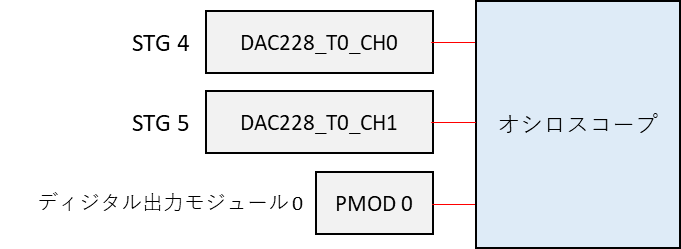

# STG を外部トリガでスタートする

[stg_external_trigger.py](./stg_external_trigger.py) は STG (Stimulus Generator) を PMOD 1 のポート 0 に割り当てられた外部トリガからスタートするスクリプトです．
本スクリプトでは，STG デザインの **独立クロックバージョン** と **同一クロックバージョン** の動作を確認できます．
2 つのバージョンの詳細は，[ディジタル出力モジュールユーザマニュアル](../../docs/stg/digital_output.md) を参照してください．

## セットアップ

DAC, PMOD とオシロスコープを接続します．



## 独立クロックバージョンの実行手順と結果

以下のコマンドを実行します．

```
python stg_external_trigger.py
```

コンソールに `Connect PMOD 0 port 0 to PMOD 1 port 1 and press 'Enter'` と表示されたら，下図の PMOD 0 の P0 と PMOD 1 の P0 を接続してから Enter を押します．


ディジタル出力モジュール 0 からディジタル値が出力されると PMOD 0 のポート 0 の電圧が Lo から Hi に変わり，接続されている PMOD 1 の P0 を通して STG のスタートトリガがかかります．

ディジタル出力モジュール と STG が動作すると DAC と PMOD から下図の波形が観測できます．

| 色 | 信号 |
| --- | --- |
| 黄色 | STG 4 |
| 水色 | STG 5 |
| ピンク | PMOD 0 P0 |


<br>


## 同一クロックバージョンの実行手順と結果

以下のコマンドを実行します．

```
python stg_external_trigger.py sync_all
```

コンソールに `Connect PMOD 0 port 0 to PMOD 1 port 1 and press 'Enter'` と表示されたら，下図の PMOD 0 の P0 と PMOD 1 の P0 を接続してから Enter を押します．


ディジタル出力モジュール 0 からディジタル値が出力されると PMOD 0 のポート 0 の電圧が Lo から Hi に変わり，接続されている PMOD 1 の P0 を通して STG のスタートトリガがかかります．

ディジタル出力モジュール と STG が動作すると DAC と PMOD から下図の波形が観測できます．

| 色 | 信号 |
| --- | --- |
| 黄色 | STG 4 |
| 水色 | STG 5 |
| ピンク | PMOD 0 P0 |


