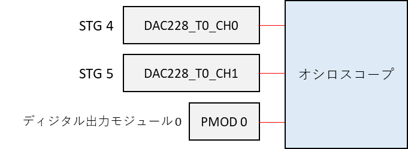
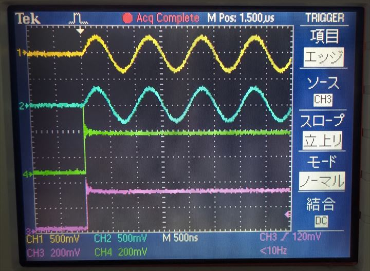
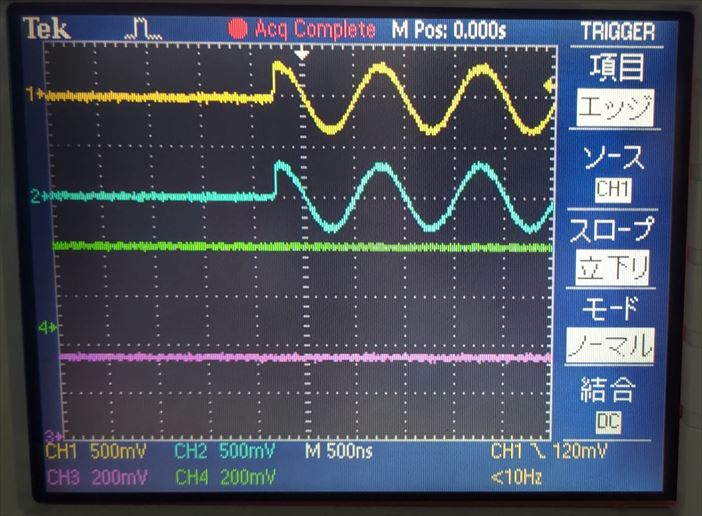
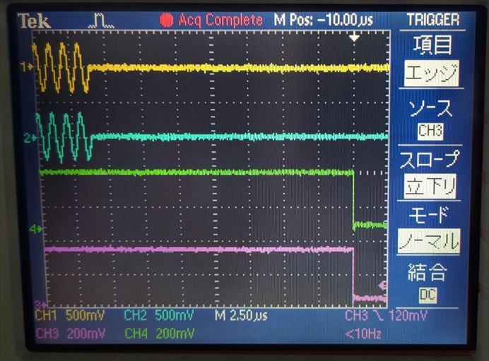
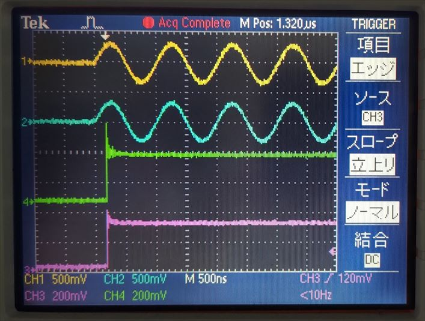
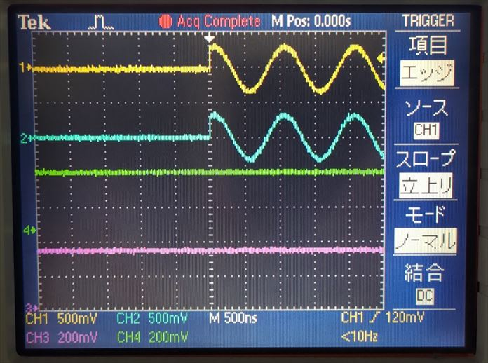
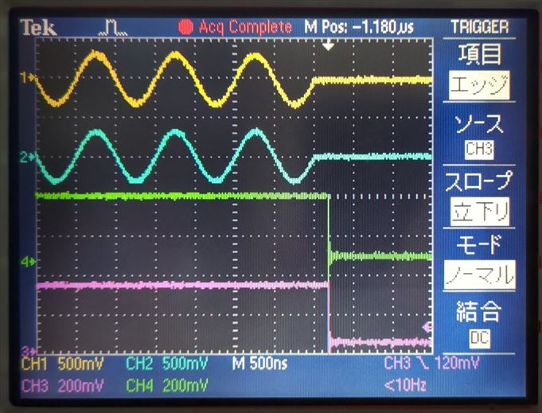

# 8つの STG から正弦波を出力する

[stg_pause.py](./stg_pause.py) は STG (Stimulus Generator) の波形出力の「一時停止」と「再開」機能を確認するスクリプトです．
本スクリプトでは，STG デザインの **独立クロックバージョン** と **同一クロックバージョン** の動作を確認できます．
2 つのバージョンの詳細は，[ディジタル出力モジュールユーザマニュアル](../../docs/stg/digital_output.md) を参照してください．

## セットアップ

DAC, PMOD とオシロスコープを接続します．



## 独立クロックバージョンの実行手順と結果

以下のコマンドを実行します．

```
python stg_send.py
```

STG とディジタル出力モジュールが動作を開始すると DAC と PMOD から下図の波形が観測できます．

| 色 | 信号 |
| --- | --- |
| 黄色 | STG 4 |
| 水色 | STG 5 |
| 緑 | PMOD 1 P0 |
| ピンク | PMOD 0 P0 |



<br>

コンソールに `Press 'Enter' to resume STGs` と表示されると STG が一時停止され，波形の出力が止まります．
このとき，ディジタル出力モジュールも一時停止しており，出力値が一時停止前の値から変わらなくなります．
ここで，コンソール上で Enter を入力すると STG およびディジタル出力モジュールは動作を再開し，下図の波形が観測できます．



<br>

STG とディジタル出力モジュールの動作再開から数秒で両方の動作が終了し，下図の波形が観測できます．




## 同一クロックバージョンの実行手順と結果

以下のコマンドを実行します．

```
python stg_send.py sync_all
```

STG とディジタル出力モジュールが動作を開始すると DAC と PMOD から下図の波形が観測できます．

| 色 | 信号 |
| --- | --- |
| 黄色 | STG 4 |
| 水色 | STG 5 |
| 緑 | PMOD 1 P0 |
| ピンク | PMOD 0 P0 |



<br>

コンソールに `Press 'Enter' to resume STGs` と表示されると STG が一時停止され，波形の出力が止まります．
このとき，ディジタル出力モジュールも一時停止しており，出力値が一時停止前の値から変わらなくなります．
ここで，コンソール上で Enter を入力すると STG およびディジタル出力モジュールは動作を再開し，下図の波形が観測できます．



<br>

STG とディジタル出力モジュールの動作再開から数秒で両方の動作が終了し，下図の波形が観測できます．


