# STG とディジタル出力モジュールから波形を出力する

[stg_send.py](./stg_send.py) は，8 つの STG (Stimulus Generator) から異なるパターンの波形を出力するスクリプトです．
本スクリプトでは，STG デザインの **独立クロックバージョン** と **同一クロックバージョン** の動作を確認できます．
2 つのバージョンの詳細は，[ディジタル出力モジュールユーザマニュアル](../../docs/stg/digital_output.md) を参照してください．

## セットアップ

DAC, PMOD とオシロスコープを接続します．


## 独立クロックバージョンの実行手順と結果

以下のコマンドを実行します．

```
python stg_send.py
```

DAC と PMOD からの出力がオシロスコープで観察できます．


STG 0, STG 1 の波形

| 色 | 信号 |
| --- | --- |
| 黄色 | STG 0 |
| 水色 | STG 1 |

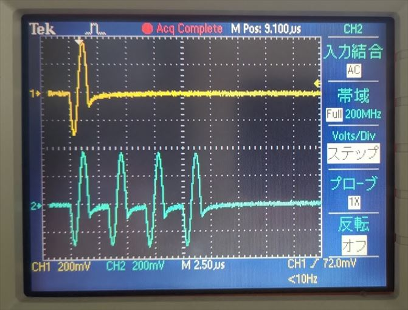

<br>

STG 0, STG 1 の波形の先頭部分

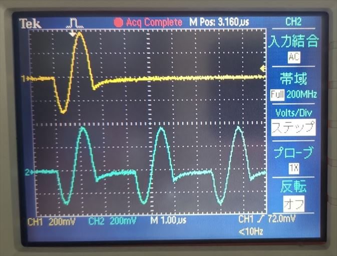

<br>

STG 4, STG 5 の波形

| 色 | 信号 |
| --- | --- |
| 黄色 | STG 4 |
| 水色 | STG 5 |

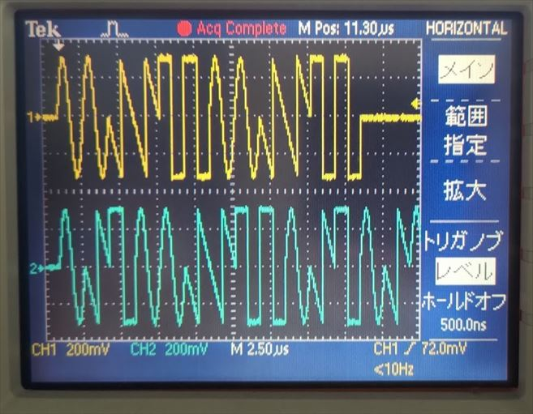

<br>

STG 4, STG 5 の波形の先頭部分

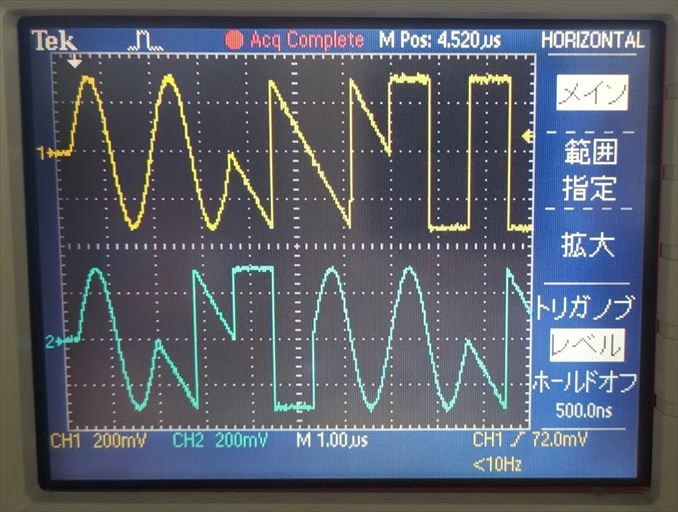

<br>

STG 6, STG 7 の波形 

| 色 | 信号 |
| --- | --- |
| 黄色 | STG 6 |
| 水色 | STG 7 |

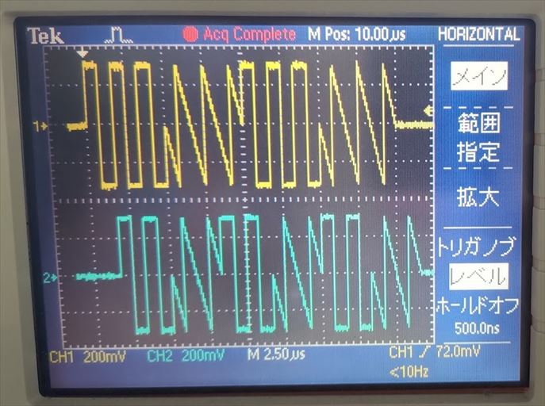

<br>

STG 6, STG 7 の波形の先頭部分

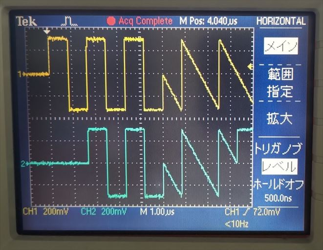

<br>

STG 0, PMOD 0 (P0, P1) の波形

| 色 | 信号 |
| --- | --- |
| 黄色 | STG 0 |
| ピンク | PMOD 0 P0 |
| 緑 | PMOD 0 P1 |

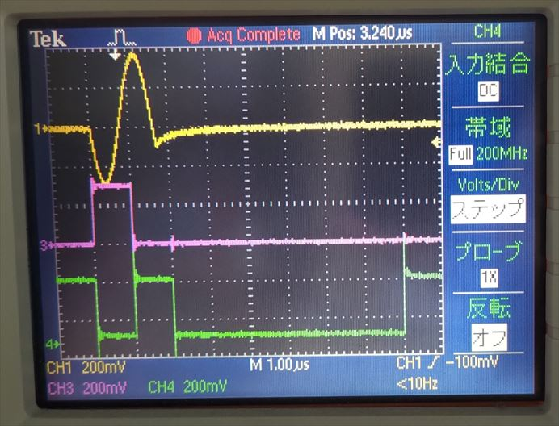

<br>

STG 0, PMOD 0 (P2, P3) の波形

| 色 | 信号 |
| --- | --- |
| 黄色 | STG 0 |
| ピンク | PMOD 0 P2 |
| 緑 | PMOD 0 P3 |

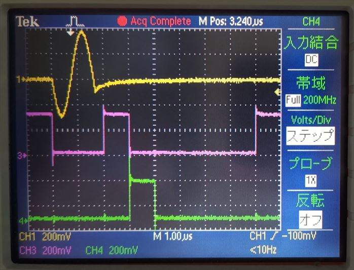

<br>

STG 0, PMOD 0 (P4, P5) の波形

| 色 | 信号 |
| --- | --- |
| 黄色 | STG 0 |
| ピンク | PMOD 0 P4 |
| 緑 | PMOD 0 P5 |

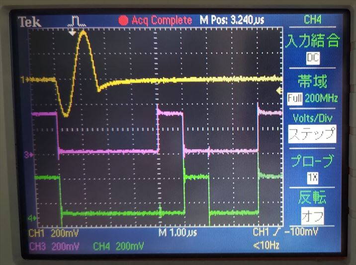

<br>

STG 0, PMOD 0 (P6, P7) の波形

| 色 | 信号 |
| --- | --- |
| 黄色 | STG 0 |
| ピンク | PMOD 0 P6 |
| 緑 | PMOD 0 P7 |

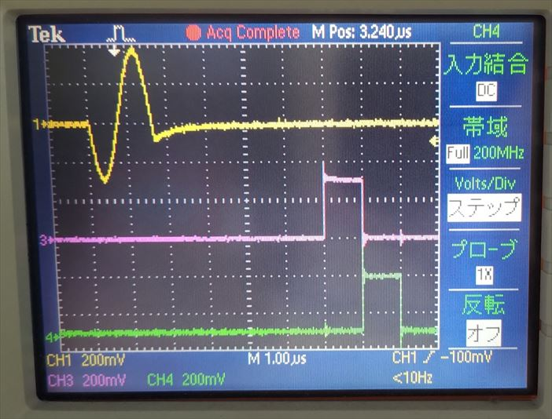

<br>

## 同一クロックバージョンの実行手順と結果

以下のコマンドを実行します．

```
python stg_send.py sync_all
```

DAC と PMOD からの出力がオシロスコープで観察できます．
STG 0 ~ 7 の波形は独立クロックバージョンと同じです．


<br>

STG 0, PMOD 0 (P0, P1) の波形

| 色 | 信号 |
| --- | --- |
| 黄色 | STG 0 |
| ピンク | PMOD 0 P0 |
| 緑 | PMOD 0 P1 |

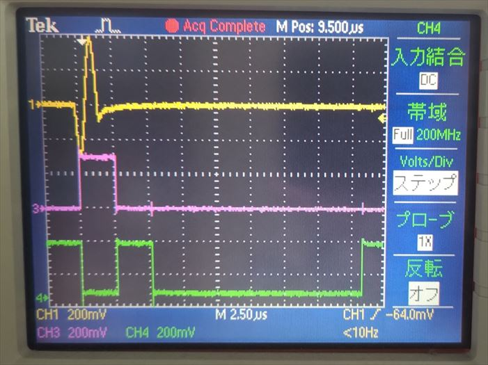

<br>

STG 0, PMOD 0 (P2, P3) の波形 

| 色 | 信号 |
| --- | --- |
| 黄色 | STG 0 |
| ピンク | PMOD 0 P2 |
| 緑 | PMOD 0 P3 |

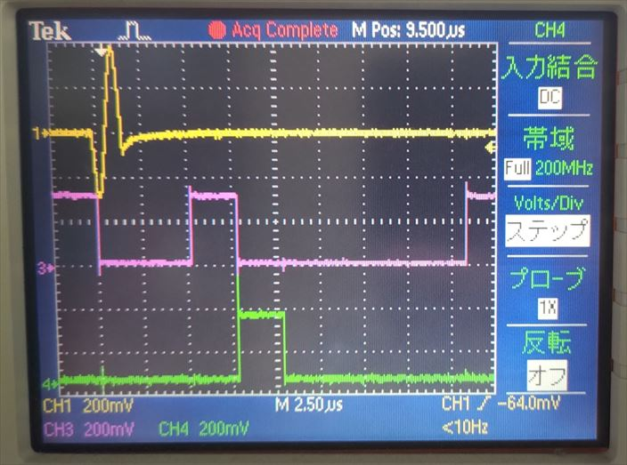

<br>

STG 0, PMOD 0 (P4, P5) の波形

| 色 | 信号 |
| --- | --- |
| 黄色 | STG 0 |
| ピンク | PMOD 0 P4 |
| 緑 | PMOD 0 P5 |

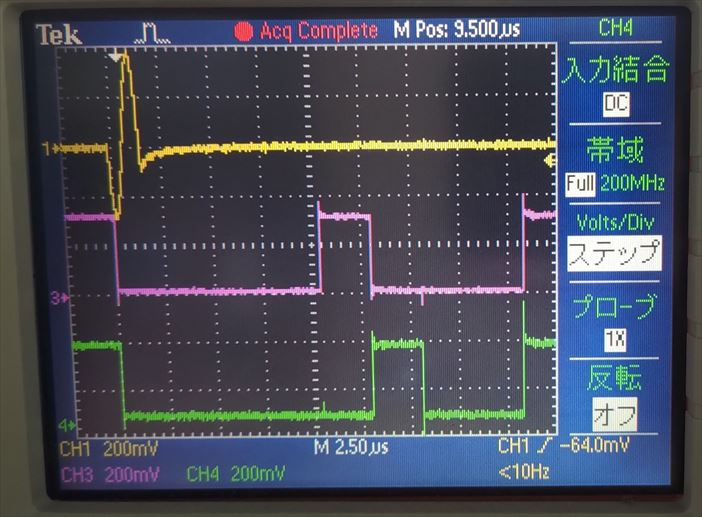

<br>

STG 0, PMOD 0 (P6, P7) の波形

| 色 | 信号 |
| --- | --- |
| 黄色 | STG 0 |
| ピンク | PMOD 0 P6 |
| 緑 | PMOD 0 P7 |

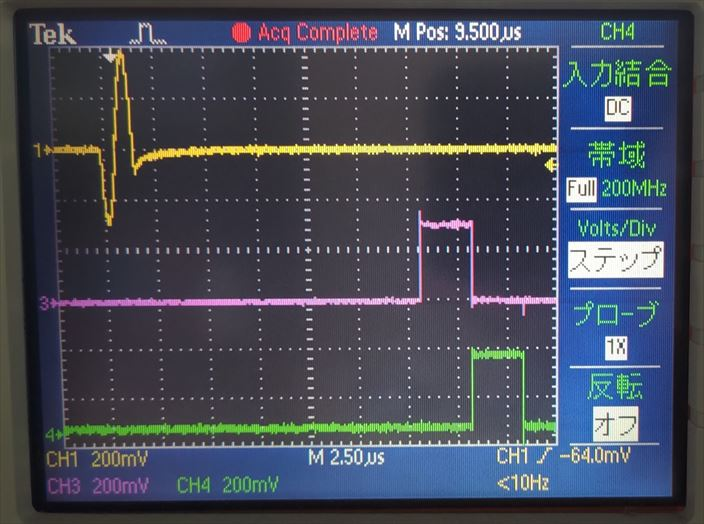
