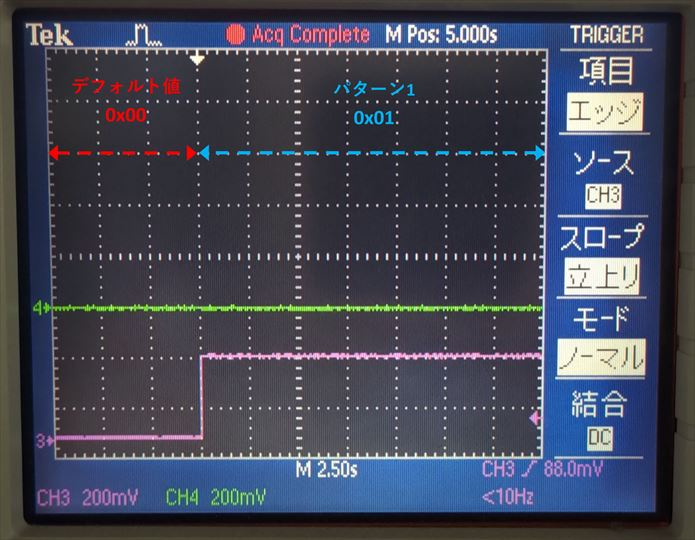
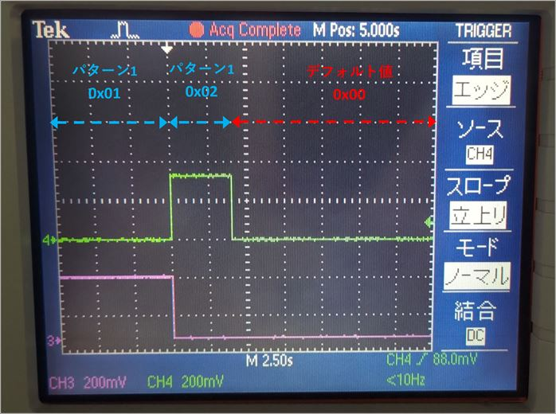
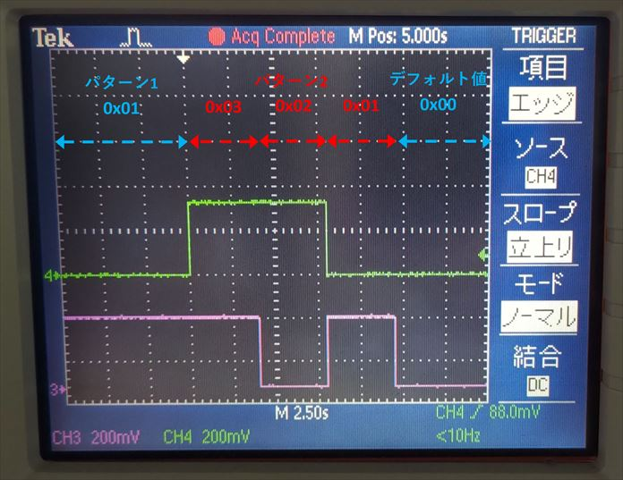
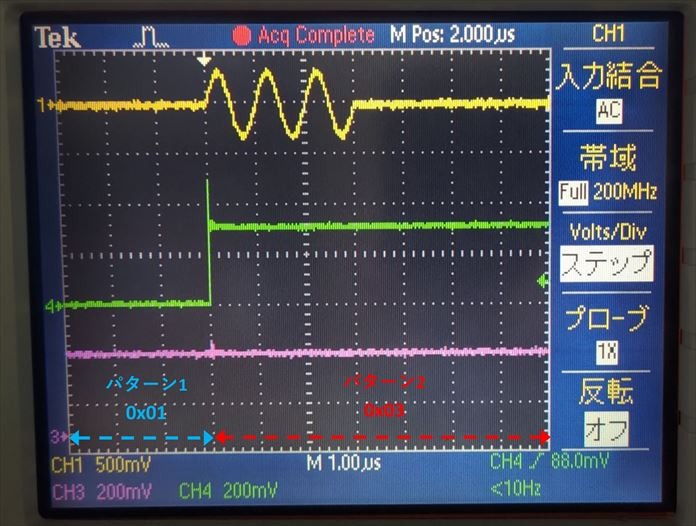

# 8つの STG から正弦波を出力する

[stim_gen_pause.py](./stim_gen_pause.py) は，ディジタル出力モジュールの「一時停止」、「再開」、「再スタート」機能を確認するためのスクリプトです．
これらの機能の詳細は [ディジタル出力モジュールユーザマニュアル](../../docs/stg/digital_output.md) を参照してください．

## セットアップ

DAC, PMOD とオシロスコープを接続します．


## 出力されるディジタル値

本スクリプトで設定されるディジタル出力値のリストは 2 パターンあります．
最初にパターン 1 の 0x01 が出力され，ディジタル出力モジュールは「一時停止」されます．
その後，ディジタル値の出力を「再開」した場合，パターン 1 の 0x02 が出力されます．
一方，ディジタル出力モジュールを「再スタート」した場合，パターン 2 の 3 つの値が順に出力されます．
PMOD 0 と PMOD 1 は同じ値を出力します．


## 独立クロックバージョンの実行手順と結果

以下のコマンドを実行します．

```
python stim_gen_pause.py
```

PMOD 0 と PMOD 1 からディジタル出力値がオシロスコープで観察できます．
ディジタル出力モジュールがデフォルト値 (= 0x00) を出力している状態から，パターン 1 の 0x01 を出力して一時停止するまでの PMOD のデータは以下のようになります．(ピンク : 出力値の 0 ビット目，緑 : 出力値の 1 ビット目)



<br>

一時停止後に以下のメッセージが表示されるので，0, 1, 2 のいずれかをコンソールに入力して Enter を押します．

```
input
    0: resume
    1: restart from software
    2: restart from STG
```

0 (再開) を選択した場合，以下の波形が出力されます．



<br>

1 (ソフトウェアから再スタート) または 2 (STG の波形出力開始に合わせて再スタート) を選択した場合，以下の波形が出力されます．



<br>

2 を選択した場合，以下の図のようにパターン 1 の出力値 0x01 からパターン 2 の出力値 0x03 に切り替わる際に STG 4 から波形が出力されることが確認できます．(ピンク : 出力値の 0 ビット目，緑 : 出力値の 1 ビット目, 黄色 : STG 4 の波形)．



<br>

## 同一クロックバージョンの実行手順と結果

以下のコマンドを実行します．

```
python stim_gen_pause.py sync_all
```

出力されるメッセージと観測される波形は，独立クロックバージョンと同じです．
