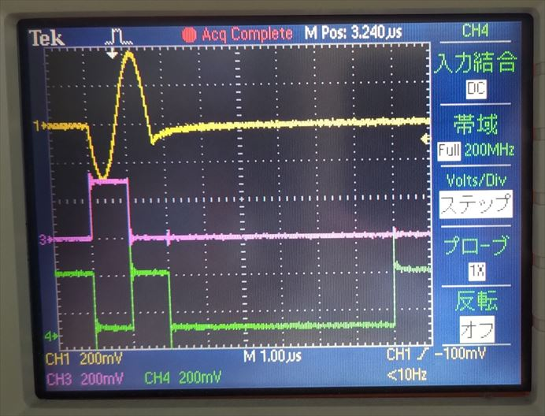

# 8つの STG から正弦波を出力する

[stim_gen_send.py](./stim_gen_send.py) は，8 つの STG (Stimulus Generator) からそれぞれ周波数の異なる正弦波を出力するスクリプトです.

## セットアップ

DAC, PMOD とオシロスコープを接続します．


## 実行手順と結果

以下のコマンドを実行します．

```
python stim_gen_send.py
```

DAC と PMOD からの出力がオシロスコープで観察できます．


STG 0, STG 1, STG 4 の波形  (上から順に STG 0, STG 1, STG 4)


<br>

STG 5, STG 6, STG 7 の波形  (上から順に STG 5, STG 6, STG 7)


<br>

STG 0, PMOD 0 (P0, P1) の波形   (上から順に STG 0, PMOD 0 P0, P1)



<br>

STG 0, PMOD 0 (P2, P3) の波形   (上から順に STG 0, PMOD 0 P2, P3)


<br>

STG 0, PMOD 0 (P4, P5) の波形   (上から順に STG 0, PMOD 0 P4, P5)


<br>

STG 0, PMOD 0 (P6, P7) の波形   (上から順に STG 0, PMOD 0 P6, P7)


