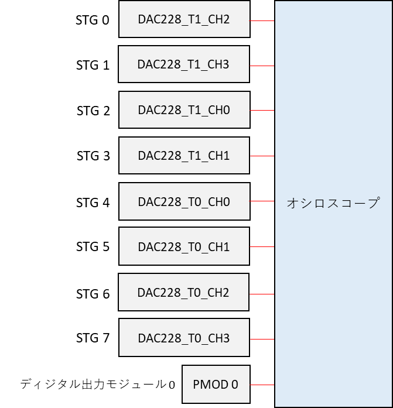
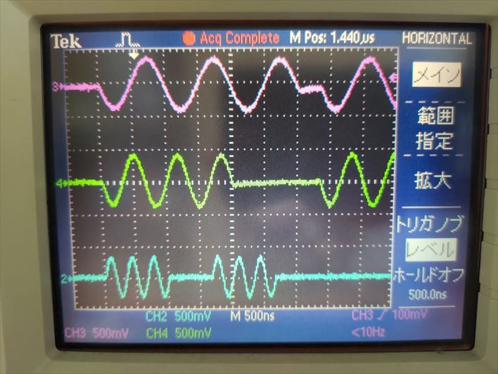
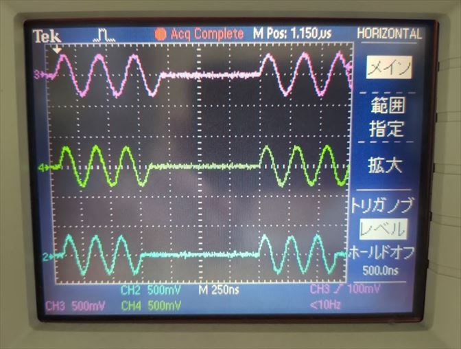

# STG を強制停止する

[stim_gen_termination.py](./stim_gen_termination.py) は波形を出力中の STG を強制停止するスクリプトです．

## セットアップ

DAC, PMOD とオシロスコープを接続します．



## 実行手順と結果

以下のコマンドを実行します．

```
python stim_gen_termination.py
```

DAC から下図のような波形が連続的に出力されます．
PMOD は 40 秒ほど全てのポートが Hi になります．
「press Enter to stop STGs.」と表示されたら Enter を押してください．
DAC の波形出力と PMOD からのディジタル値の出力が止まります．

STG 0, STG 1, STG 4 の波形  (上から順に STG 0, STG 1, STG 4)



<br>

STG 5, STG 6, STG 7 の波形  (上から順に STG 5, STG 6, STG 7)


